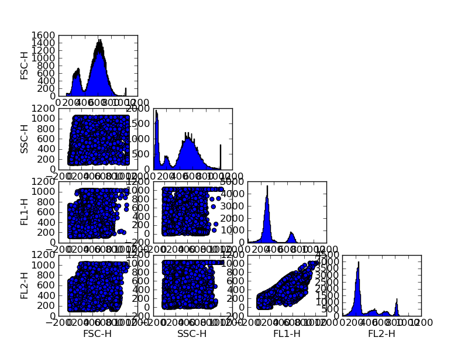

.. fcm documentation master file, created by
   sphinx-quickstart on Mon Jun 14 15:17:43 2010.
   You can adapt this file completely to your liking, but it should at least
   contain the root `toctree` directive.

Welcome to fcm's documentation!
===============================

Contents:

.. toctree::
   :maxdepth: 2

   demo.rst
   classes.rst

.. _intro:

What is fcm?
============

fcm is a library for working with flow cytometry data.  Its goal is to provide an easy to use interface for managing and analyzing fcm data, with a focus on statistical modeling, that is:

 * Simple

  - uses sensible defaults
  - has a consisten api
  - delivers convenience functions where apropreate
  - "Pythonic"

 * Efficent

  - uses fast code and algorithms provided by others (ie, numpy and scipy)
  - optimizes slow parts with extensions in C/C++/(optionally Cuda) where appropriate

::

  from fcm import LoadFCS
  from fcm.gui import pair_plot
  
  data = LoadFCS('/home/jolly/Projects/fcm/sample_data/3FITC_4PE_004.fcs')
  pair_plot(data, savefile='pair.png', display=False)

See :ref:`demo` for more examples

Indices and tables
==================

* :ref:`genindex`
* :ref:`modindex`
* :ref:`search`

