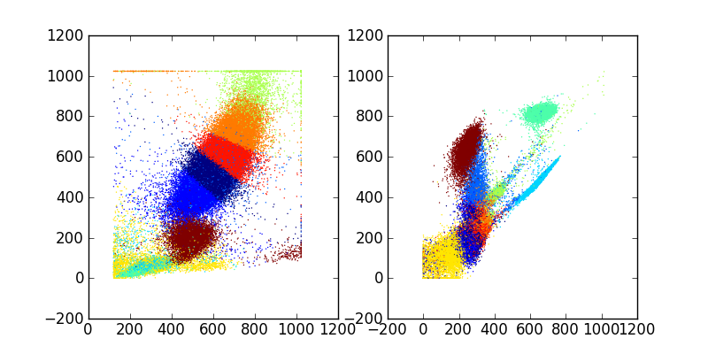
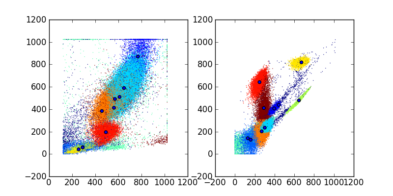
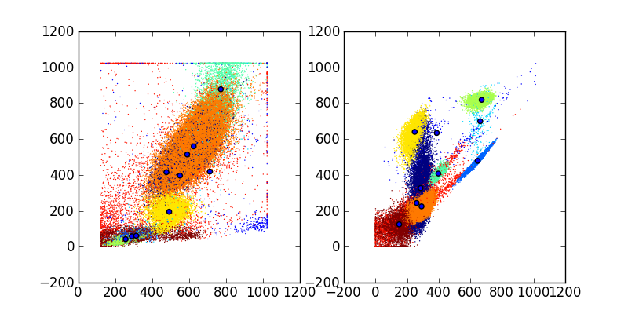

Advanced *fcm* tutorial
#######################

Graphics
********
:py:mod:`fcm` provides several convenience functions for plotting common flow cytometry
plots. These include :py:func:`fcm.graphics.hist`, :py:func:`fcm.graphics.heatmap`,

Histogram using :py:func:`graphics.hist`
========================================
:py:func:`fcm.graphics.hist` plots overlay histogram for the specified channel.

.. code-block:: ipython

   In [1]: import fcm
   
   In [2]: import fcm.graphics as graph
   
   In [3]: from glob import glob
   
   In [4]: xs =[fcm.loadFCS(x) for x in glob('B6901GFJ-08_*.fcs')]
   
   In [5]: graph.hist(xs,3, display=True)
   
.. figure:: hist.png
   :align: center
   :height: 400px
   :alt: histogram of channel 3 of three fcs files
   :figclass: align-center

Heat maps using :py:func:`fcm.graphics.heatmap`
==============================================
:py:func:`fcm.graphics.heatmap` provides a quick function to generate heat map scatter
plots.  Multiple pairs of channels passed as tuples can be passed to generate multiple
plots at once.  If you wish to generate your own heat maps, :py:mod:`fcm` also provides
:py:func:`fcm.graphics.bilinear_interpolate` and :py:func:`fcm.graphics.trilinear_interpolate`
to calculate the intensity at a given point.

.. code-block:: ipython

   In [1]: import fcm
   
   In [2]: import fcm.graphics as graph
   
   In [3]: x = fcm.loadFCS('B6901GFJ-08_CMV pp65.fcs')
   
   In [4]: graph.heatmap(x,[(7,12)])
   
.. figure:: heatmap.png
   :align: center
   :height: 400px
   :alt: example heat map
   :figclass: align-center
   
View logicle transformed axis
=============================
Often when viewing logicle transformed data it is desirable to see the scale units
in the original transformed data.  :py:func:`fcm.graphics.set_logicle` will set
the axis units on a plot to the original untransformed scaling.  :py:func:`fcm.graphics.set_logicle`
takes a matplotlib axis object and a string of ``'x'`` or ``'y'`` and sets the scale of the
axis as appropriate.

Automated positivity thresholds
*******************************
:py:mod:`fcm` provides a method for automatically determining positivity thresholds on fcm 
data, by comparing a positive and negative control sample.  Gate objects for this are
generated by the :py:func:`fcm.generate_f_score_gate` taking a negative sample, a positive sample,
and the channel to compare.

Clustering
**********
The :py:mod:`fcm.statistics` module provides several models to automate 
cell subset identification.  The basic models are fit using k-means by :py:class:`fcm.statistics.KMeansModel`
and or a mixture of Gaussians by :py:class:`fcm.statistics.DPMixtureModel`.  Models are thought
of as a collection of model parameters that can be used to fit multiple data sets using their fit method.
fit methods then return a result object describing the estimated model fitting (means locations
for :py:class:`fcm.statistics.KMeansModel`, weights, means and covariances for :py:class:`fcm.statistics.DPMixtureModel`)

Clustering using K-Means
========================

.. code-block:: ipython
   
   In [1]: import fcm, fcm.statistics as stats
   
   In [2]: import pylab
   
   In [3]: data = fcm.loadFCS('/home/jolly/Projects/fcm/sample_data/3FITC_4PE_004.fcs')
   
   In [4]: kmmodel = stats.KMeansModel(10, niter=20, tol=1e-5)
   
   In [5]: results = kmmodel.fit(data)
   
   In [6]: c = results.classify(data)
   
   In [7]: pylab.subplot(1,2,1)
   Out[7]: <matplotlib.axes.AxesSubplot at 0x81b3ca0d0>
   
   In [8]: pylab.scatter(data[:,0], data[:,1], c=c, s=1, edgecolor='none')
   Out[8]: <matplotlib.collections.CircleCollection at 0x81b3eab90>
   
   In [9]: pylab.subplot(1,2,2)
   Out[9]: <matplotlib.axes.AxesSubplot at 0x81b3b3690>
   
   In [10]: pylab.scatter(data[:,2], data[:,3], c=c, s=1, edgecolor='none')
   Out[10]: <matplotlib.collections.CircleCollection at 0x827d0ee10>
   
   In [11]: pylab.savefig('kmeans.png')

produces

Clustering with Mixture Models
------------------------------

An alternative to simple k-means models to describe the distribution of 
flow data is to use a mixture of Gaussian (normal) distributions, and use
the probability of belonging to each Gaussian to assign cells to clusters.
The :py:class`fcm.statistics.DPMixtureModel` is used to describe these mixtures 
of Gaussians and estimate the weights (pis), means (mus), and covariances (sigmas)
of the distribution.  Using the :py:mod:`dpmix` module we have two methods of estimating
these parameters, Markov chain Monte Carlo (mcmc) and Bayesian expectation maximization (BEM)

Fitting the model using MCMC
----------------------------
.. code-block:: ipython

   In [1]: import fcm, fcm.statistics as stats
   
   In [2]: import pylab
   
   In [3]: data = fcm.loadFCS('/home/jolly/Projects/fcm/sample_data/3FITC_4PE_004.fcs')
   
   In [4]: dpmodel = stats.DPMixtureModel(10, niter=100)
   
   In [5]: dpmodel.ident =True
   
   In [6]: results = dpmodel.fit(data,verbose=10)
   starting MCMC
   -100
   -90
   -80
   -70
   -60
   -50
   -40
   -30
   -20
   -10
   10
   20
   30
   40
   50
   60
   70
   80
   90
   
   In [7]: avg = results.average()
   
   In [8]: mus = avg.mus()
   
   In [9]: c = avg.classify(data)
   
   In [10]: pylab.subplot(1,2,1)
   Out[10]: <matplotlib.axes.AxesSubplot at 0x8287bad10>
   
   In [11]: pylab.scatter(data[:,0], data[:,1], c=c, s=1, edgecolor='none')
   Out[11]: <matplotlib.collections.CircleCollection at 0x8287ce750>
   
   In [12]: pylab.scatter(mus[:,0], mus[:,1])
   Out[12]: <matplotlib.collections.CircleCollection at 0x8287ce450>
   
   In [13]: pylab.subplot(1,2,2)
   Out[13]: <matplotlib.axes.AxesSubplot at 0x8287ce8d0>
   
   In [14]: pylab.scatter(data[:,2], data[:,3], c=c, s=1, edgecolor='none')
   Out[14]: <matplotlib.collections.CircleCollection at 0x829038d90>
   
   In [15]: pylab.scatter(mus[:,2], mus[:,3])
   Out[15]: <matplotlib.collections.CircleCollection at 0x829038a50>
   
   In [16]: pylab.savefig('dpmix.png')
   
   

Fitting the model using BEM
---------------------------
.. code-block:: ipython

   In [1]: import fcm, fcm.statistics as stats
   
   In [2]: import pylab
   
   In [3]: data = fcm.loadFCS('/home/jolly/Projects/fcm/sample_data/3FITC_4PE_004.fcs')
   
   In [4]: dpmodel = stats.DPMixtureModel(10, niter=100, type='bem')
   
   In [5]: results = dpmodel.fit(data,verbose=10)
   starting BEM
   0:, -941157.006634
   10:, -158859.825045
   20:, -144465.587253
   30:, -111709.700352
   40:, -111378.962977
   50:, -111366.297392
   60:, -111365.592223
   
   In [6]: mus = results.mus()

   In [7]: c = results.classify(data)
   
   In [8]: pylab.subplot(1,2,1)
   Out[8]: <matplotlib.axes.AxesSubplot at 0x81b7503d0>
   

   
   In [9]: pylab.scatter(data[:,0], data[:,1], c=c, s=1, edgecolor='none')
   Out[9]: <matplotlib.collections.CircleCollection at 0x8287c1810>
   
   In [10]: pylab.scatter(mus[:,0], mus[:,1])
   Out[10]: <matplotlib.collections.CircleCollection at 0x8287f03d0>
   
   In [11]: pylab.subplot(1,2,2)
   Out[11]: <matplotlib.axes.AxesSubplot at 0x808e03d50>
   
   In [12]: pylab.scatter(data[:,2], data[:,3], c=c, s=1, edgecolor='none')
   Out[12]: <matplotlib.collections.CircleCollection at 0x827cef790>
   
   In [13]: pylab.scatter(mus[:,2], mus[:,3])
   Out[13]: <matplotlib.collections.CircleCollection at 0x827cef410>
   
   In [14]: pylab.savefig('bem.png')

