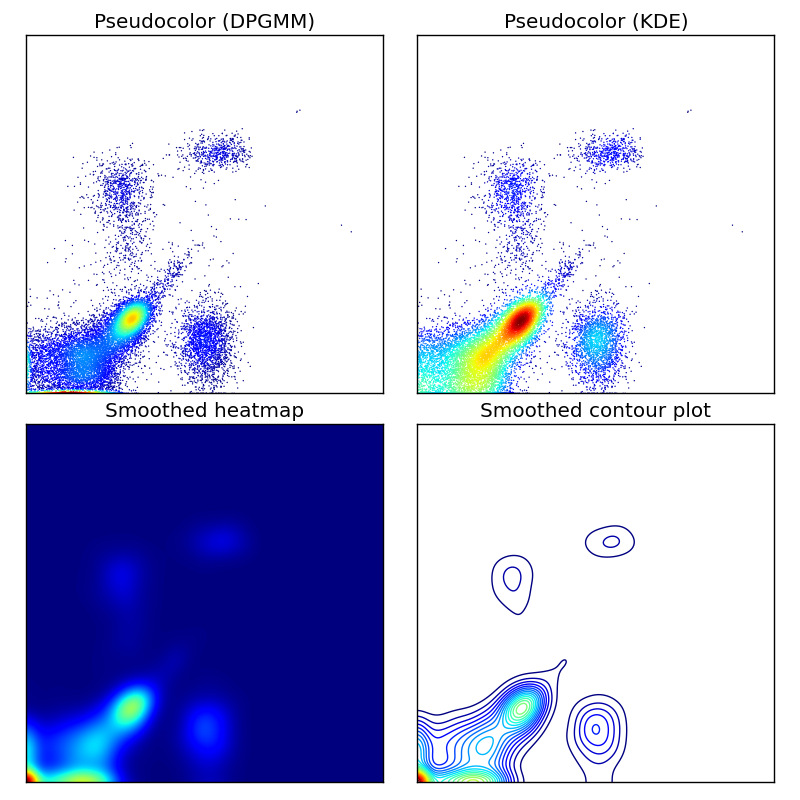
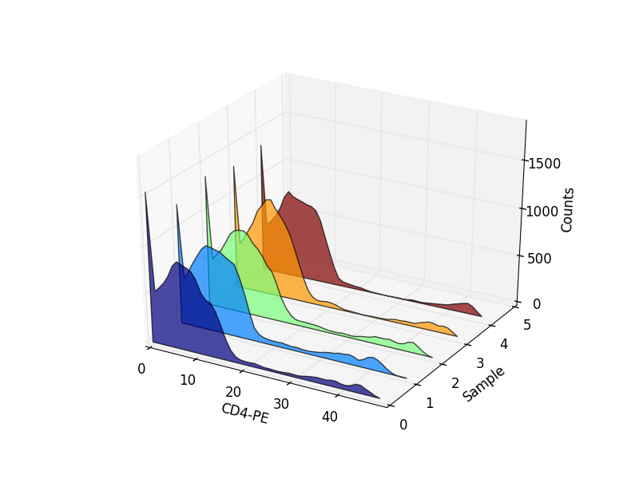
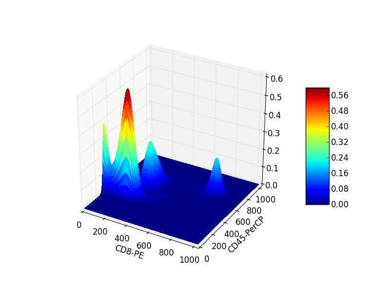
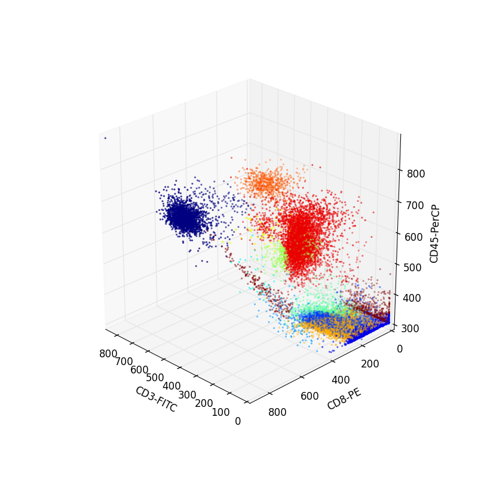
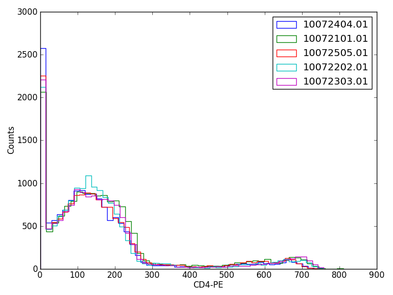
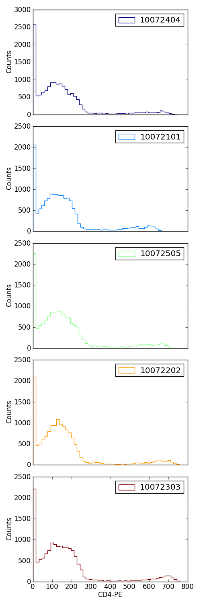

.. py:currentmodule:: fcm

Example gallery
###############
The gallery contains images to different types of plots that it's possible to build
using :py:mod:`fcm` can be used to make with source code for how they are generated.
Some scripts may require the use of additional libraries or modules.

Example Dotplots
----------------

   
:download:`Different types of dot plots<gallery/g_dotplot.py>`

3d Histograms
-------------

:download:`3d stacked histogram<gallery/g_3dhist.py>`

3d Surface Plot
---------------

   
:download:`3d surface plot<gallery/g_3dsurface.py>`

3d Scatter Plot
---------------

   
:download:`3d scatter plot<gallery/g_3dscatter.py>`

Overlay Histogram
-----------------

   
:download:`overlay histograms<gallery/g_overlay_hist.py>`

Stacked Histograms
------------------

  
:download:`Stacked Histograms<gallery/g_stacked_hist.py>`
